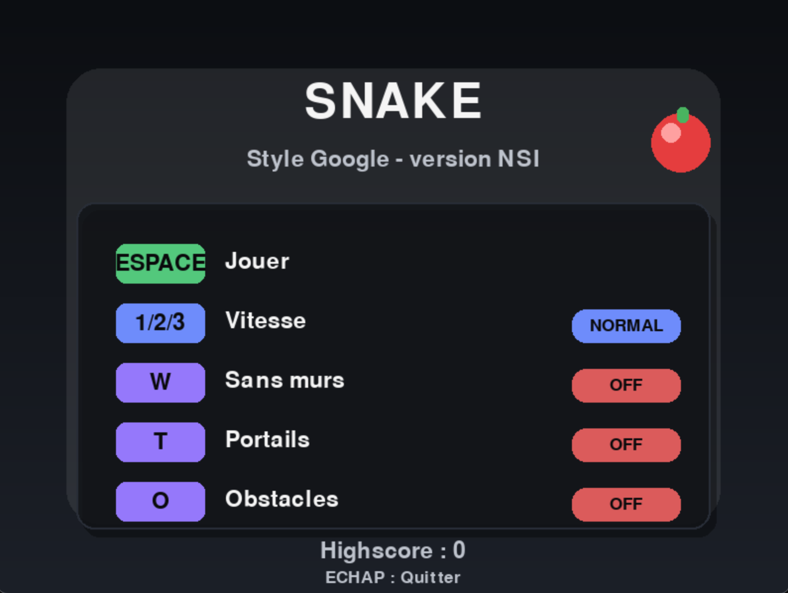
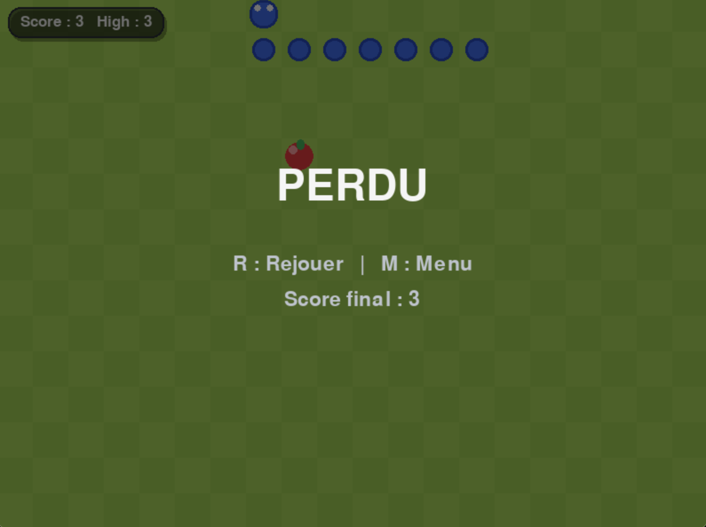

#  Snake — Projet Personnel 
## Recréation du Snake Google en Python (Pygame), avec animation fluide et architecture propre

* * *

##  Présentation

Ce dépôt contient un **jeu Snake** développé en **Python** avec une interface graphique en **Pygame**, inspiré du **Snake Google**.

Points clés :
- Déplacement **en cases** (logique simple, stable)
- Rendu **moderne** (grille verte style Google + UI sobre)
- **Animation fluide** (interpolation entre deux états de grille)
- Projet volontairement **petit** : **5 fichiers maximum** côté jeu

* * *

##  Gameplay (règles)

- Le joueur dirige le serpent avec les flèches.
- Le but est de **manger des pommes** pour grandir et augmenter le score.
- La partie se termine en cas de collision (selon les options activées).

* * *

##  Fonctionnalités principales

###  Gameplay
- Déplacement en cases (comme Snake Google)
- Score + Highscore (persistant dans `highscore.txt`)
- Pause en jeu

###  Options (menu)
- **Sans murs (wrap)** : le serpent réapparaît de l’autre côté
- **Portails** : téléportation entre deux cases
- **Obstacles** : cases bloquantes
- Vitesses : **lent / normal / rapide**


* * *

##  Animation fluide (important)

Le jeu est logique **en cases**, mais l’affichage est **fluide** :
- Le moteur conserve l’état **avant** le tick (`serpent_precedent`)
- Le moteur conserve l’état **après** le tick (`serpent`)
- L’interface Pygame **interpole** entre les deux pour obtenir un mouvement doux


* * *

##  Architecture du projet

Séparation claire des responsabilités :
- `engine.py` → **moteur du jeu** (règles, déplacements, collisions, score) **sans Pygame**
- `pygame_app.py` → **interface graphique** (affichage, menu, inputs, animations)
- `config.py` → configuration (fenêtre, grille, vitesses…)
- `storage.py` → lecture/écriture du highscore
- `main.py` → point d’entrée

Objectifs :
- Tester/faire évoluer le moteur sans dépendre de l’interface
- Garder un code lisible et modifiable rapidement

* * *

##  Structure du projet

    jeu_snake/
    │
    └── sources/
        ├── main.py
        ├── config.py
        ├── engine.py
        ├── pygame_app.py
        ├── storage.py
        ├── requirements.txt
        ├── highscore.txt
    │
    └── docs/
        ├── index.html
        ├── styles.css
        └── assets/
            ├── screen-menu.png
            └── screen-gameover.png
    ├── requirements.txt
    ├── README.md
    └──  LICENSE
    

* * *

##  Captures (2)

> Place les fichiers ici : `docs/assets/`




* * *

##  Installation

Prérequis :
- Python 3.10+ (3.11 recommandé)

Installation :
```bash
git clone https://github.com/antoninche/jeu_snake.git
cd jeu_snake
python -m pip install -r requirements.txt
