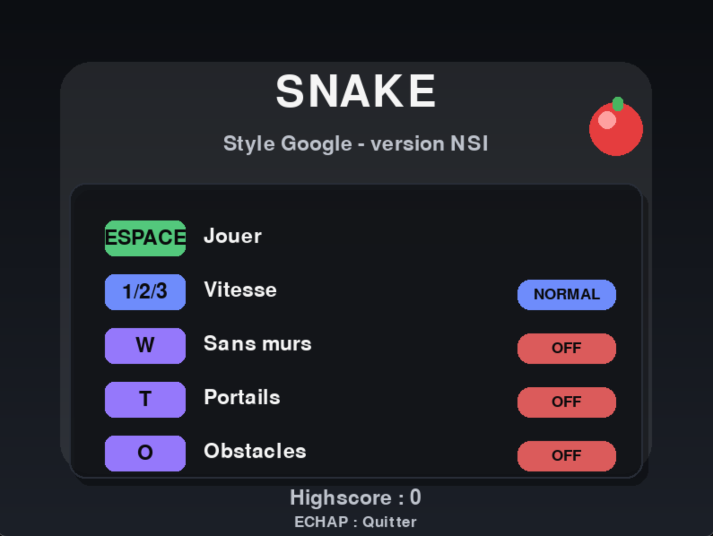
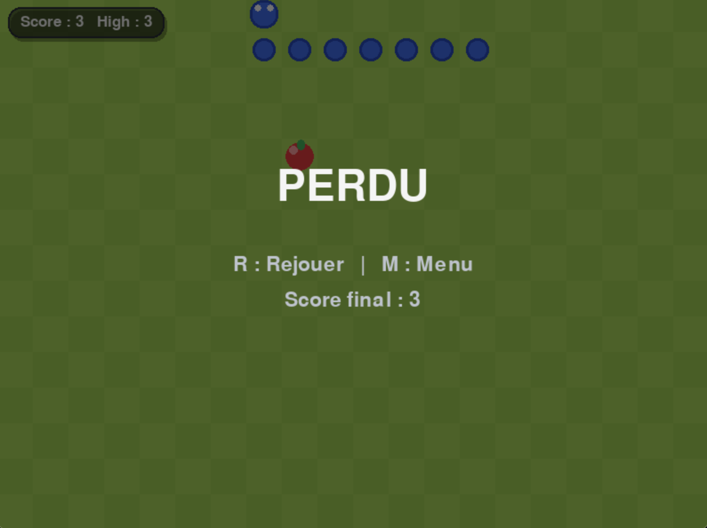

# Snake

Un Snake en Python et Pygame, inspiré de celui de Google, avec des modes de jeu
supplémentaires (portails, obstacles, sans murs) et un déplacement animé.



## Le jeu

Le serpent avance sur une grille de 20 × 15 cases. Manger une pomme le fait
grandir et rapporte des points ; deux pommes mangées coup sur coup comptent
double. Tous les 5 fruits, la vitesse augmente et de nouveaux obstacles
apparaissent.

Options réglables depuis le menu :

- **Sans murs** — le serpent ressort de l'autre côté de l'écran
- **Portails** — deux cases reliées entre elles
- **Obstacles** — cases bloquantes ajoutées au fil des niveaux
- Vitesse de départ : lente, normale ou rapide

`M` coupe le son, `P` met en pause.

## Architecture

`engine.py` contient toutes les règles du jeu et ne dépend pas de Pygame :
collisions, génération des pommes, score, niveaux. `pygame_app.py` ne fait
que l'affichage et la lecture des touches. Le moteur peut donc tourner seul,
ce qui rend les règles testables sans ouvrir de fenêtre.

L'animation est gérée à part : le serpent se déplace case par case au tick,
mais l'affichage interpole entre l'ancienne et la nouvelle position, ce qui
donne un rendu fluide sans toucher à la logique de jeu.

Le highscore est écrit dans le dossier utilisateur (`~/Library/Application Support`
sur macOS, `%APPDATA%` sur Windows) et non à côté du script, pour survivre
au packaging en `.app` / `.exe`.

## Lancer le jeu

```bash
pip install -r requirements.txt
python sources/main.py
```

Une version Windows prête à l'emploi (`SnakeGoogle.exe`) est disponible dans
les [Releases](https://github.com/antoninche/jeu_snake/releases). Windows
Defender affiche un avertissement : l'exécutable n'est pas signé.


